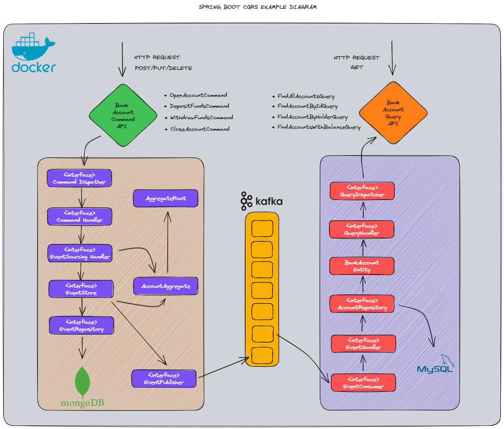
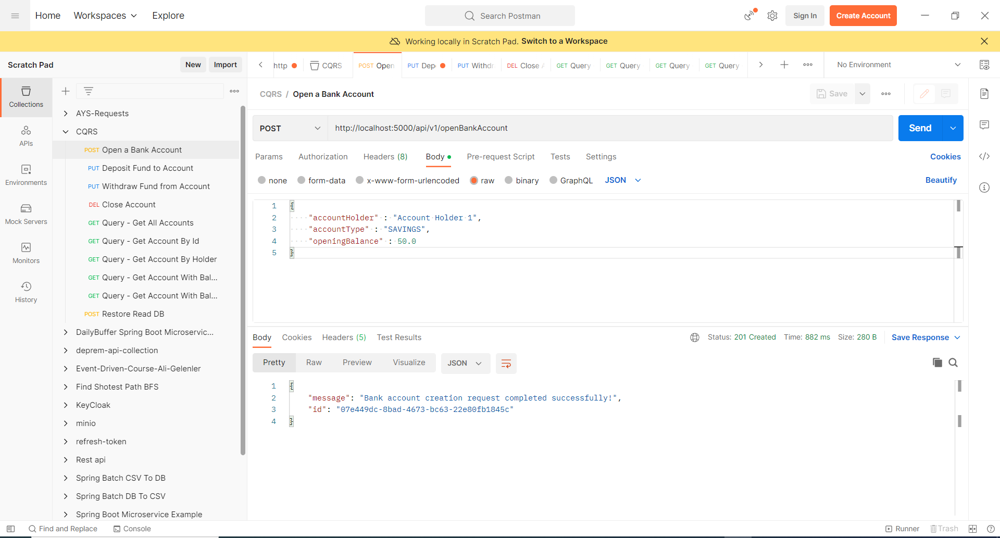
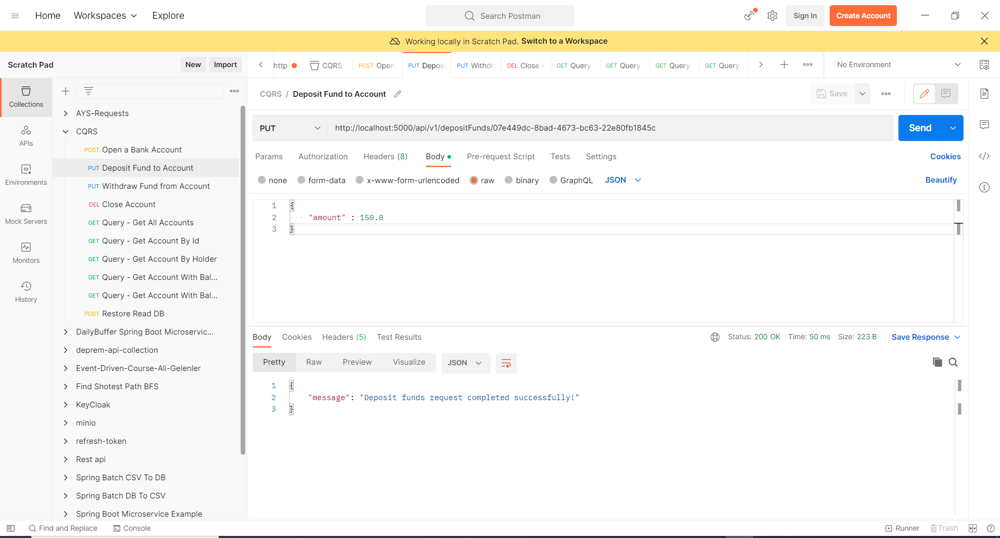
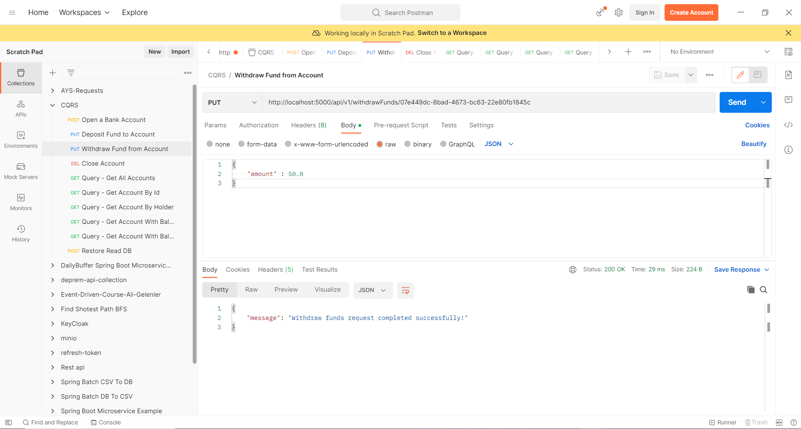
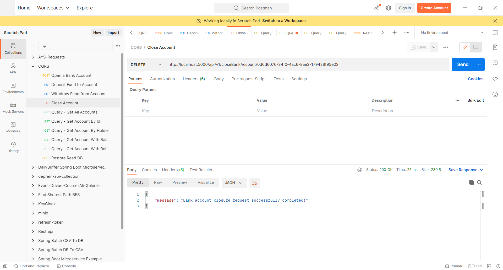
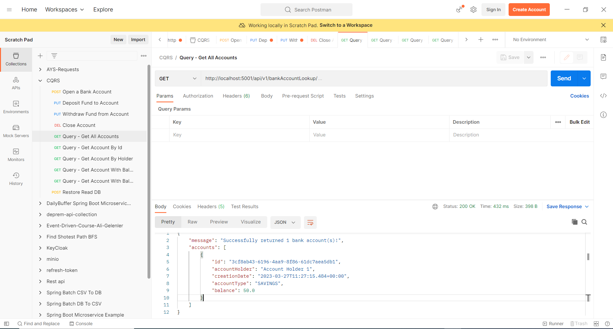
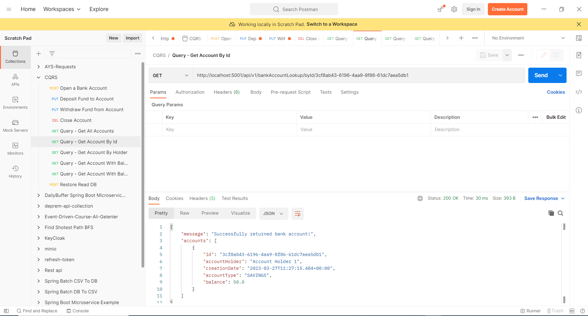
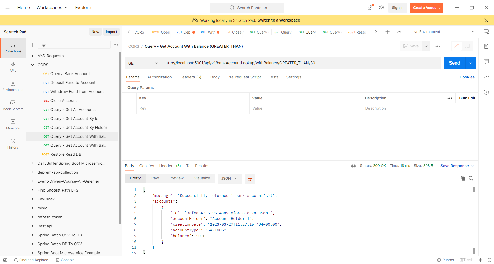
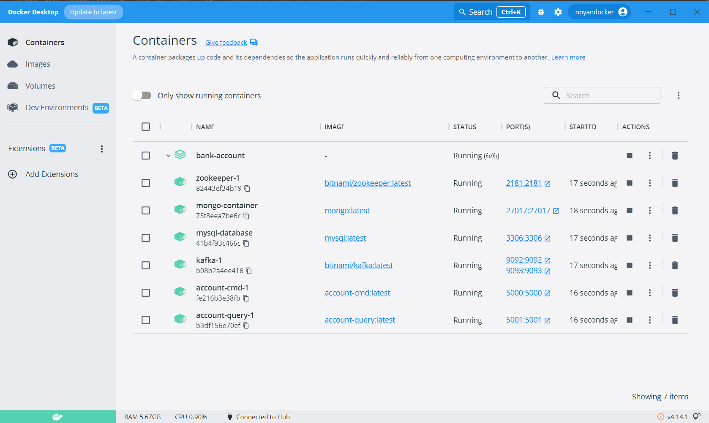

# Spring Boot CQRS Example (Docker, Apache Kafka, Zookeeper, MYSQL, MongoDB)



### 📖 Information

<ul style="list-style-type:disc">
  <li><b>CQRS</b> (Command Query Responsibility Segregation) is an architectural pattern that separates a system into two parts: one for updating data (<b>commands</b>) and another for reading data (<b>queries</b>).</li>  
  <li><b>CQRS</b> is implemented in this project with running on Docker and it provides the necessary components to build an event-driven handling with <b>Apache Kafka</b></li>
</ul>

### Explore Rest APIs

<table style="width:100%">
  <tr>
      <th>Method</th>
      <th>Url</th>
      <th>Description</th>
      <th>Valid Request Body</th>
      <th>Valid Request Params</th>
      <th>Valid Request Params and Body</th>
      <th>No Valid Request Params and Body</th>
  </tr>
  <tr>
      <td>POST</td>
      <td>/api/v1/openBankAccount</td>
      <td>Open a Bank Account</td>
      <td><a href="README.md#openBankAccount">Info</a></td>
      <td></td>
      <td></td>
  </tr>
  <tr>
      <td>PUT</td>
      <td>/api/v1/depositFunds/{id}</td>
      <td>Deposit Fund to the Account</td>
      <td></td>
      <td></td>
      <td><a href="README.md#deposit">Info</a></td>
  </tr>
  <tr>
      <td>PUT</td>
      <td>/api/v1/withdrawFunds/{id}</td>
      <td>Withdraw Fund from Account</td>
      <td><a href="README.md#withdraw">Info</a></td>
      <td></td>
      <td></td>
  </tr>
  <tr>
      <td>DELETE</td>
      <td>/api/v1/closeBankAccount/{id}</td>
      <td>Close Account</td>
      <td></td>
      <td><a href="README.md#closeAccount">Info</a></td>
      <td></td>
  </tr>
  <tr>
      <td>GET</td>
      <td>/api/v1/bankAccountLookup/</td>
      <td>Get All Accounts</td>
      <td></td>
      <td></td>
      <td><a href="README.md#getAllAccount">Info</a></td>
  </tr>
  <tr>
      <td>GET</td>
      <td>/api/v1/bankAccountLookup/{id}</td>
      <td>Get Account By Id</td>
      <td><a href="README.md#getAccountById">Info</a></td>
      <td></td>
      <td></td>
  </tr>
  <tr>
      <td>GET</td>
      <td>/api/v1/bankAccountLookup/byHolder/{account_holder}</td>
      <td>Get Account By Holder</td>
      <td><a href="README.md#getAccountByHolder">Info</a></td>
      <td></td>
      <td></td>
  </tr>
  <tr>
      <td>GET</td>
      <td>/api/v1/bankAccountLookup/withBalance/GREATER_THAN/{value}</td>
      <td>Get Account By Balance Greather Then Value</td>
      <td><a href="README.md#getAccountByBalanceGreatherThen">Info</a></td>
      <td></td>
      <td></td>
  </tr>
  <tr>
      <td>GET</td>
      <td>/api/v1/bankAccountLookup/withBalance/LESS_THAN/{value}</td>
      <td>Get Account By Balance Less Then Value</td>
      <td><a href="README.md#getAccountByBalanceLessThen">Info</a></td>
      <td></td>
      <td></td>
  </tr>
  <tr>
      <td>GET</td>
      <td>/api/v1/restoreReadDb</td>
      <td>Restore Database By Read</td>
      <td></td>
      <td></td>
      <td><a href="README.md#restoreDatabaseByRead">Info</a></td>
  </tr>

</table>

### Used Dependencies
* Core
    * Spring
        * Spring Boot
        * Spring Data
            * Spring Data JPA
* Database
    * Mysql
    * Mongodb
* Kafka
* Lombok
* Docker

## Valid Request Body

##### <a id="openBankAccount"> Open a Bank Account
```
    http://localhost:5000/api/v1/openBankAccount
    
    {
        "accountHolder" : "Account Holder 1",
        "accountType" : "SAVINGS",
        "openingBalance" : 50.0
    }
    
```

## Valid Request Params

##### <a id="closeAccount">Close Account
```
    http://localhost:5000/api/v1/closeBankAccount/{id}
    
    Bearer Token : User Token
```

##### <a id="getAccountById">Get Account By Id
```
    http://localhost:5001/api/v1/bankAccountLookup/byId/{id}
    
```

##### <a id="getAccountByHolder">Get Account By Holder
```
    http://localhost:5001/api/v1/bankAccountLookup/byHolder/{account_holder}
    
```

##### <a id="getAccountByBalanceGreatherThen">Get Account Greather then Value
```
    http://localhost:5001/api/v1/bankAccountLookup/withBalance/GREATER_THAN/{value}
    
```

##### <a id="getAccountByBalanceLessThen">Get Account Less then Value
```
    http://localhost:5001/api/v1/bankAccountLookup/withBalance/LESS_THAN/{value}
    
```

## Valid Request Params and Body

##### <a id="deposit">Deposit Fund to the Account
```
    http://localhost:5000/api/v1/depositFunds/{id}
    
    {
        "amount" : 150.0
    }
```

##### <a id="withdraw">Withdraw Fund from Account
```
    http://localhost:5000/api/v1/withdrawFunds/{id}
    
    {
        "amount" : 50.0
    }
```


## No Valid Request Params and Body

##### <a id="getAllAccount">Get All Accounts
```
    http://localhost:5001/api/v1/bankAccountLookup/
    
```

##### <a id="restoreDatabaseByRead">Restore Database By Read
```
    http:localhost:5000/api/v1/restoreReadDb
    
```

### 🔨 Run the App

There are 2 ways to run the app.

### Maven

1. Install mysql in your computer
2. Install mongodb in your computer
3. Download your project from this link `https://github.com/Rapter1990/cqrs-example`
4. Go to the project's home directory :  `cd cqrs-example`
5. Go to the bank-account :  `cd bank-account`
6. Create a jar file under bank-account directory though this command  `mvn clean install`
7. Run the project though this command `mvn spring-boot:run`
8. Send any request of collection under postman collections folder through Postman 
9. Show data from both mongodb by following all these commands shown below
```
    -> Open Mongodb Comprass
    -> Create a new connection (mongodb://localhost:27017)
    -> Show data from eventStore collection of bankAccount database
```
10. Show data from both mongodb by following all these commands shown below
```
    -> Open Mysql Workbench
    -> Use default connection
    -> Show data from bank_account table of bankAccount database
```

### Docker Compose

1. Download your project from this link `https://github.com/Rapter1990/cqrs-example`
2. Go to the project's home directory :  `cd cqrs-example`
3. Go to the bank-account directory :  `cd bank-account`
4. Run docker-compose though this command `docker-compose up --build`
5. Send any request of collection under postman collections folder through Postman
6. Show data from both mongodb by following all these commands shown below
```
    -> docker exec -it mongo-container bash
    -> mongosh
    -> show dbs
    -> use bankAccount
    -> show collections
    -> db.eventStore.find({})
```
7. Show data from both mongodb by following all these commands shown below
```
    -> docker exec -it mysql-database mysql -uroot -p
    -> Enter password: password defined in database
    -> USE bankAccount
    -> show tables;
    -> SELECT * FROM bank_account;
```

### Show data from both mongodb and 

### Screenshots

<details>
<summary>Click here to show the screenshots of project</summary>
    <p> Figure 1 </p>
    
    <p> Figure 2 </p>
    
    <p> Figure 3 </p>
    
    <p> Figure 4 </p>
    
    <p> Figure 5 </p>
    
    <p> Figure 6 </p>
    
    <p> Figure 7 </p>
    
    <p> Figure 8 </p>
    
    <p> Figure 9 </p>
    
    <p> Figure 10 </p>
    
</details>
